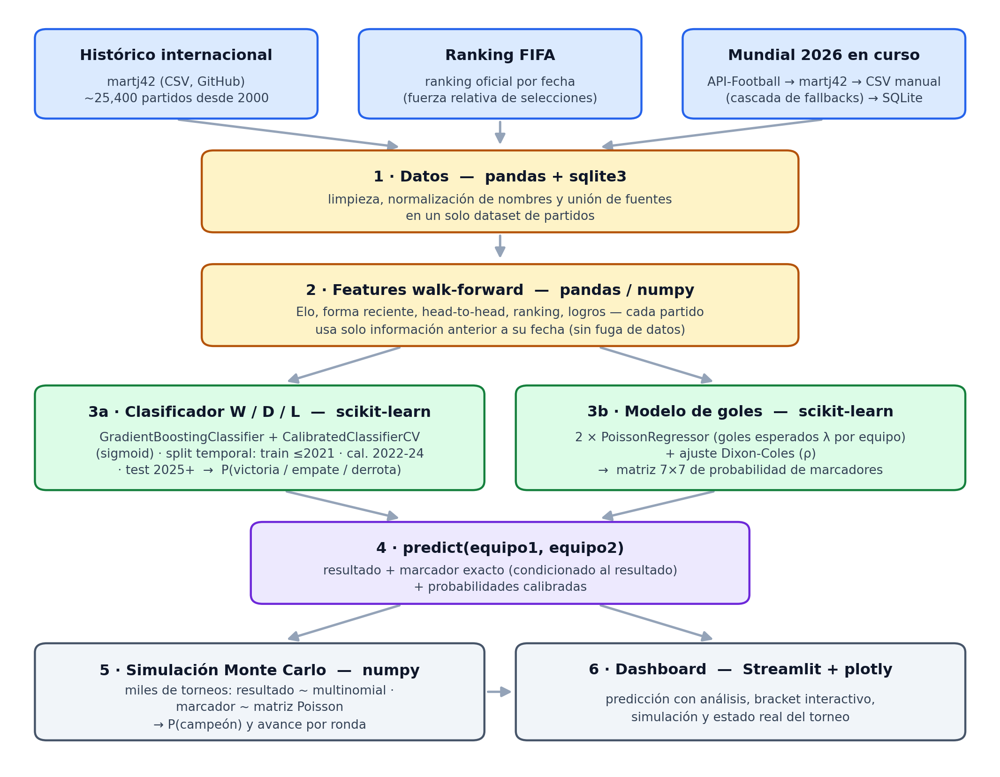

# ⚽ Predictor Mundial 2026

Proyecto académico — Universidad Tecnológica de Panamá (FISC), materia de Programación (ML con Python).

Sistema de predicción de partidos del Mundial FIFA 2026 que produce **tres salidas por partido**:

1. **Resultado** (victoria / empate / derrota) — clasificación multiclase con scikit-learn.
2. **Marcador exacto** — modelo de goles esperados (Poisson) con ajuste Dixon-Coles.
3. **Probabilidades calibradas** de cada resultado (no solo la predicción dura).

Además: **simulación Monte Carlo** del torneo (completo o desde el estado real actual) e
**integración con API-Football** para los partidos del Mundial 2026 en curso.

## Cómo funciona



En resumen: los datos históricos se limpian y unen con **pandas**, se construyen
features walk-forward (Elo, forma, head-to-head, ranking) sin fuga de datos, y con
ellas se entrenan dos modelos de **scikit-learn**: un clasificador calibrado que da
las probabilidades de victoria/empate/derrota y un modelo Poisson que produce la
matriz de marcadores. `predict(equipo1, equipo2)` combina ambos, y sobre eso corren
la simulación Monte Carlo (**numpy**) y el dashboard (**Streamlit**).

## Cómo correr

Requiere Python 3.12.

```bash
python3.12 -m venv .venv && source .venv/bin/activate
pip install -r requirements.txt

# (opcional) clave de API-Football para el sync en vivo
cp .env.example .env   # y editar APIFOOTBALL_KEY

# pipeline completo: datos -> features -> modelos -> backtest -> simulaciones
python -m scripts.build_all              # ~5-10 min (el backtest es lo más lento)
python -m scripts.build_all --skip-backtest --use-cache   # versión rápida

# dashboard
streamlit run dashboard/app.py
```

Comandos individuales:

```bash
python -m src.predict "Argentina" "France"    # predicción de un partido (CLI)
python -m scripts.validate_api                # ¿cubre el free tier la season 2026?
python -m scripts.sync_wc2026                 # sync WC2026 -> data/database.db
python -m src.evaluation.backtest             # backtest walk-forward
python -m src.simulation.montecarlo --simulations 5000     # torneo completo
python -m src.simulation.tournament_state --simulations 5000  # desde estado actual
```

## Datos y almacenamiento

- **Histórico**: [martj42/international_results](https://github.com/martj42/international_results)
  (~49,500 partidos desde 1872; se modela desde el año 2000 → ~25,400) + ranking FIFA oficial. CSVs en `data/raw/` y `data/processed/`.
- **Mundial 2026 en curso**: SQLite (`data/database.db`) con cascada de fuentes:
  1. **API-Football** (api-sports.io) — *validado el día 1: el free tier NO cubre la
     season 2026* (solo 2022-2024), el sistema lo detecta y hace fallback automático;
  2. **martj42** — ya incluye los partidos jugados del WC2026;
  3. **CSV manual** (`data/manual/wc2026_results.csv`) — para resultados muy recientes
     que martj42 aún no refleja (se usó para los octavos del 5 de julio).
- Por la limitación del free tier no se usan stats avanzadas (posesión, tiros); el
  Elo y el ranking FIFA son las señales principales, como preveía el plan.

## Metodología (resumen)

- **Split temporal**: train ≤ 2021 · calibración 2022-2024 · test 2025+ (corte duro
  2026-06-10: nada del Mundial en curso entra al entrenamiento).
- **Calibración**: isotonic vs sigmoid comparados por Brier en el test temporal; se
  seleccionó sigmoid (isotonic sobreajustó la ventana de calibración). Curvas en
  `outputs/figures/calibration_curve.png`.
- **Marcador exacto**: dos `PoissonRegressor` (λ de goles por equipo) → matriz 7×7 de
  marcadores con ajuste Dixon-Coles (ρ por búsqueda en malla de la log-verosimilitud).
  El marcador mostrado se condiciona al resultado del clasificador (consistencia).
- **Backtest walk-forward** (`outputs/backtest_results.csv`): para cada año Y de
  2018-2025 se reentrena solo con datos anteriores. Resultados (media ponderada):
  **60% de accuracy W/D/L**, log-loss 0.879, RPS 0.172, **13% de acierto de marcador
  exacto** (referencia en literatura: 10-12%).
- **Monte Carlo**: resultado ~ multinomial(probabilidades calibradas); marcador ~
  matriz Poisson condicionada; ruido lognormal por ronda en λ. Modo "estado actual":
  resultados reales fijos + bracket oficial (`data/manual/bracket_2026.json`, partidos
  89-104) y se simula solo lo pendiente.

## Estructura

```
├── data/{raw,processed,manual}/  + database.db (SQLite, solo WC2026)
├── docs/              pipeline.png (diagrama del README)
├── models/            match_outcome.pkl, poisson_goals.pkl
├── outputs/           CSVs de simulación/backtest + figures/
├── scripts/           build_all, validate_api, sync_wc2026, import_manual_results
├── src/
│   ├── data/          historical_data, achievements, api_football, db
│   ├── features/      match_features (walk-forward), live_features
│   ├── models/        match_model (GBM+calibración), poisson_model (+Dixon-Coles)
│   ├── evaluation/    backtest
│   ├── simulation/    montecarlo, tournament_state
│   └── predict.py     API central: equipo1, equipo2 -> 3 salidas
└── dashboard/app.py   Streamlit (5 pestañas: predicción con análisis, bracket
                       interactivo, simulación, estado del torneo, metodología)
```

## Limitaciones conocidas

- El modo "torneo completo" usa **sorteo aleatorio del cuadro eliminatorio**
  (el modo "estado actual" sí usa el bracket real).
- Empates en eliminatorias van directo a penales (tasa histórica de tandas); no se
  modela la prórroga por separado.
- El recall de empates del clasificador es bajo (típico en W/D/L); las probabilidades
  calibradas y la matriz de Poisson son la forma honesta de leer los empates.
- Sin stats avanzadas de equipo (free tier de API-Football no cubre la season 2026).
- El partido por el tercer puesto no se simula (no afecta la probabilidad de campeón).
